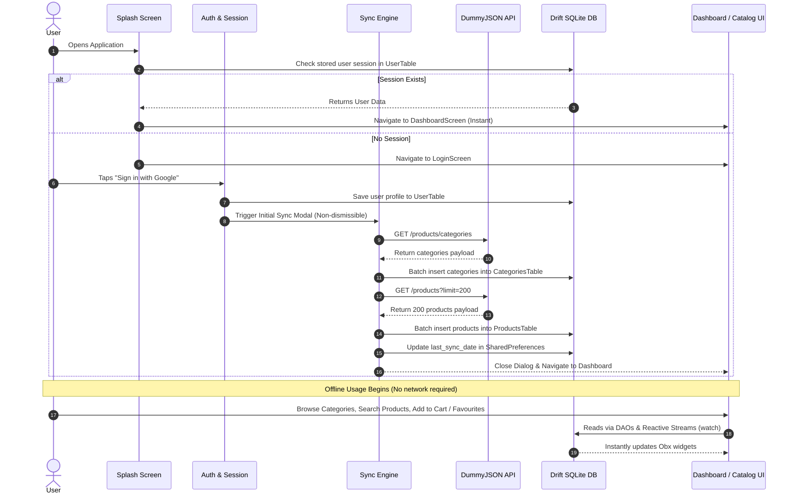
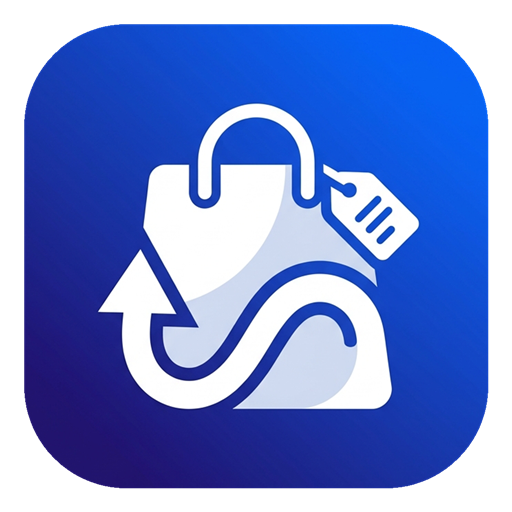

# 🛍️ Offline-First Product Catalog & Cart App

An enterprise-grade, **offline-first** mobile application built with **Flutter**, **Drift (SQLite)**, **GetX**, and **Google SSO**. Designed for resilience in low-connectivity or offline environments, the app ensures that once initial catalog synchronization is completed, users can browse categories, filter and search products, view rich product details, manage their wishlist, and handle cart orders entirely offline without making direct API calls from the UI.

---

## 📑 Table of Contents
- [Key Highlights & Requirements Fulfilled](#-key-highlights--requirements-fulfilled)
- [Architecture & Data Flow](#-architecture--data-flow)
- [Application Flow & Features](#-application-flow--features)
  - [1. Authentication & Local User Session](#1-authentication--local-user-session)
  - [2. Initial Data Sync Engine (Non-Dismissible)](#2-initial-data-sync-engine-non-dismissible)
  - [3. Dashboard Screen](#3-dashboard-screen)
  - [4. Category Navigation & Product Browsing](#4-category-navigation--product-browsing)
  - [5. Product Details & Image Carousel](#5-product-details--image-carousel)
  - [6. Favourites & Wishlist Module](#6-favourites--wishlist-module)
  - [7. Cart & Checkout Calculation Module](#7-cart--checkout-calculation-module)
- [Offline-First Architecture & Design Principles](#-offline-first-architecture--design-principles)
- [Project Directory Structure](#-project-directory-structure)
- [State Management & Local Storage Strategy](#-state-management--local-storage-strategy)
  - [Drift (SQLite) Schema & DAOs](#drift-sqlite-schema--daos)
  - [GetX State & Reactive Stream Binding](#getx-state--reactive-stream-binding)
- [Error Handling & Edge Cases](#-error-handling--edge-cases)
- [Getting Started & Installation](#-getting-started--installation)
  - [Prerequisites](#prerequisites)
  - [Setup Instructions](#setup-instructions)
  - [Running Code Generation](#running-code-generation)
  - [Running the App](#running-the-app)
  - [Building Production Release](#building-production-release)
- [Testing](#-testing)
- [Screenshots & Visual Preview](#-screenshots--visual-preview)

---

## 🌟 Key Highlights & Requirements Fulfilled

| Requirement | Implementation Detail | Status |
| :--- | :--- | :---: |
| **Technology Stack** | Flutter 3.x, GetX (`^4.7.3`), Drift (`2.20.0`), Google Sign-In (`^7.2.0`), Dio (`^5.11.1`) | ✅ Verified |
| **Offline-First Mandate** | Strict separation: API ➔ Drift DB ➔ GetX Controller ➔ UI. All screens stream from SQLite; zero direct API calls from UI. | ✅ Verified |
| **Google SSO Authentication** | Google Sign-In with local Drift session persistence (`UserTable`), auto-login on startup, and atomic wipe on logout. | ✅ Verified |
| **Mandatory Initial Sync** | Non-dismissible download modal, live byte & percentage tracking for Categories and Products (200 items), with retry capability. | ✅ Verified |
| **Catalog Dashboard** | User Profile, Total Categories count, Total Products count, Last Sync timestamp, and Quick Actions. | ✅ Verified |
| **Category & Product List** | Dynamic category bottom sheet, horizontal category chips, real-time multi-attribute search, pull-to-refresh, and sorting (Price / Rating). | ✅ Verified |
| **Product Details** | Image carousel with indicator, price/discount computation, rating, stock status, full description, and quick-action bar. | ✅ Verified |
| **Favourites Module** | Add/remove bookmarks persisted in Drift `FavouritesTable`, reactive stream updates, and dedicated listing screen. | ✅ Verified |
| **Cart Module** | Quantity stepper (`+` / `-`), auto-removal at 0, Drift SQLite joined queries, dynamic Subtotal, Discount, and Grand Total computations. | ✅ Verified |
| **Resilience & Error Handling** | Pre-flight connectivity checking, Dio cancel tokens, graceful handling of offline launch, empty states for search and cart. | ✅ Verified |

---

## 🏗️ Architecture & Data Flow

The project strictly follows the **Mandatory Offline-First Architecture**:

```
┌────────────────────────────────────────────────────────┐
│                   Remote REST API                      │
│      (https://dummyjson.com/products/categories)       │
│      (https://dummyjson.com/products?limit=200)        │
└───────────────────────────┬────────────────────────────┘
                            │ Dio HTTP (Sync Phase Only)
                            ▼
┌────────────────────────────────────────────────────────┐
│                   Data Access Layer                    │
│            Drift SQLite (offline_cart_db)              │
│  [UserTable] [CategoriesTable] [ProductsTable]         │
│  [CartTable] [FavouritesTable]                         │
└───────────────────────────┬────────────────────────────┘
                            │ Reactive Streams (watch() / DAOs)
                            ▼
┌────────────────────────────────────────────────────────┐
│                 GetX Controller Layer                  │
│  • AuthController           • ProductSyncController    │
│  • DashboardController      • CategoryProductsController│
│  • ProductDetailsController • CartController           │
│  • FavouritesController                                │
└───────────────────────────┬────────────────────────────┘
                            │ Obx() / Reactive State Binding
                            ▼
┌────────────────────────────────────────────────────────┐
│                    Presentation UI                     │
│  • SplashScreen             • LoginScreen              │
│  • DashboardScreen          • CategoryProductsScreen   │
│  • ProductDetailsScreen     • CartScreen & Favourites  │
└────────────────────────────────────────────────────────┘
```

### Complete User & Data Lifecycle Flow



---

## 📱 Application Flow & Features

### 1. Authentication & Local User Session
- **Google SSO Integration:** Powered by `google_sign_in` and Firebase Auth configuration.
- **Session Persistence:** Upon successful authentication, user details (`id`, `name`, `email`, `profileImage`) are stored directly into Drift's `UserTable`.
- **Auto-Login:** When the app opens, the `SplashScreen` checks the database for an existing user record. If found, the user bypasses login directly into the Dashboard.
- **Clean Logout:** Logging out triggers a confirmation dialog. Confirming wipes all tables in the local Drift SQLite database (`cartTable`, `favouritesTable`, `productsTable`, `categoriesTable`, `userTable`), clears cached images, clears `SharedPreferences`, and safely redirects to the Login screen.

### 2. Initial Data Sync Engine (Non-Dismissible)
- **Modal Lock:** A strictly non-dismissible modal (`SyncProgressDialog`) wraps the sync procedure immediately after login or during manual catalog refresh.
- **Progress Tracking:** 
  - Tracks both category downloading and batch saving.
  - Downloads 200 products with real-time percentage and byte size calculation (`KB`/`MB`).
- **Resilience & Resumption:** If an issue occurs (e.g. timeout or connection drop), the modal presents a contextual retry button. Completed steps (e.g., categories already saved) are retained so retrying continues from the products phase.
- **Connectivity Pre-check:** Uses `internet_connection_checker_plus` to verify internet access before starting network requests, showing an actionable "No internet connection" prompt if offline.

### 3. Dashboard Screen
- **User Profile Header:** Displays the authenticated user's avatar, full name, and email address.
- **Live Catalog Statistics:** Two summary cards displaying total synced categories and total synced products directly streamed from Drift.
- **Sync Status Card:** Displays the last synchronization timestamp with humanized relative time ("Just now", "X min ago", or formatted date/time).
- **Quick Actions:**
  - **View Categories:** Opens an interactive bottom sheet containing all synced categories.
  - **Refresh Data:** Re-triggers the sync engine to download the latest catalog data from the server.
  - **Logout:** Safely purges local state and session data.
- **Top Navigation Badges:** Real-time counter badges over the Heart (Favourites) and Cart icons that update immediately when items are added or removed.

### 4. Category Navigation & Product Browsing
- **Categories Bottom Sheet:** Allows searching and selecting from the complete list of synced categories.
- **Dynamic Category Chips:** A horizontal scrolling chips bar at the top of the category screen with smooth auto-scroll to the currently selected category.
- **Instant Search:** Debounce-free, in-memory/in-database search filtering across product title, brand, category, and description.
- **Sorting Options:** Bottom sheet sorting selector supporting:
  - Default / Catalog Order
  - Price: Low to High (`ASC`)
  - Price: High to Low (`DESC`)
  - Rating: High to Low (`DESC`)
  - Rating: Low to High (`ASC`)
- **Pull-to-Refresh:** Pulling down on the category list reloads the category products from the local SQLite cache.

### 5. Product Details & Image Carousel
- **Images Carousel:** Swipeable image viewer displaying all available product images with an active dot indicator.
- **Information Breakdown:** Product title, brand badge, category chip, rating with star icon, stock level, and discount percentage badge.
- **Pricing & Discounts:** Calculates and displays the discounted price alongside the strikethrough original retail price.
- **Fixed Bottom Action Bar:** Instant action buttons to toggle Favourites status and add items to Cart with feedback snackbars.

### 6. Favourites & Wishlist Module
- **Drift-Backed Storage:** All favorited product IDs are stored in `FavouritesTable`.
- **Reactive Stream Join:** The `FavouritesController` joins `favouritesTable` with `productsTable` using a reactive stream (`watchFavouriteProducts()`).
- **Instant Synchronization:** Toggling a favorite on the product details or category list screen immediately reflects in the Favourites listing and top navigation badge.

### 7. Cart & Checkout Calculation Module
- **Local Persistence:** Backed by `CartTable` with product ID and quantity columns.
- **Full Calculation Breakdown:**
  - **Item Count:** Total quantity across all cart items.
  - **Subtotal:** Computed sum using the base retail prices.
  - **Discount:** Total savings derived from discount percentages.
  - **Grand Total:** Final checkout amount based on discounted prices.
- **Quantity Steppers:** Easily increment or decrement quantities. Decrementing a product with quantity 1 automatically deletes it from the cart.
- **Clear Cart Option:** Confirmation dialog before wiping the cart items.

---

## ⚙️ Offline-First Architecture & Design Principles

```
                    ┌────────────────────────────┐
                    │      Is Internet On?       │
                    └─────────────┬──────────────┘
                                  │
                  ┌───────────────┴───────────────┐
                  ▼                               ▼
               [ YES ]                         [ NO ]
                  │                               │
        Initial Sync / Refresh         Launch App Directly
                  │                               │
         Download & Persist to           Load Stored SQLite Session
           Drift SQLite DB               and Cached Catalog Data
                  │                               │
                  └───────────────┬───────────────┘
                                  ▼
                    ┌────────────────────────────┐
                    │    100% Offline Active     │
                    │   • Browse Categories      │
                    │   • View Products & Info   │
                    │   • Search & Sort Items    │
                    │   • Add/Manage Cart & Wish │
                    └────────────────────────────┘
```

1. **Zero UI-to-Network Coupling:** UI screens never trigger `Dio` requests directly. All screen controllers bind directly to Drift DAO streams (`Stream<List<T>>`).
2. **Deterministic Startup:** The application starts from local SQLite state. Even if the device has no cellular or Wi-Fi connectivity upon launch, the catalog remains fully accessible.
3. **Single Source of Truth:** Drift SQLite is the sole source of truth for UI state. When data changes (such as adding an item to the cart), the database table is mutated, and the continuous stream automatically updates any listening `Obx` widgets.

---

## 📂 Project Directory Structure

```text
offline_cart/
├── assets/
│   ├── icons/                   # App icons and graphics
│   ├── images/                  # App logo and promotional assets
│   └── svg/                     # Vector icons (google.svg, etc.)
│
├── lib/
│   ├── main.dart                # App entry point, Firebase init & GetMaterialApp
│   │
│   ├── core/
│   │   └── extensions/          # Extension methods (safe numeric/string parsing)
│   │
│   ├── data/
│   │   ├── local/
│   │   │   ├── daos/            # Drift Data Access Objects (Cart, Category, Favourites, Products, User)
│   │   │   │   ├── cart_dao.dart
│   │   │   │   ├── category_dao.dart
│   │   │   │   ├── favourites_dao.dart
│   │   │   │   ├── products_dao.dart
│   │   │   │   └── user_dao.dart
│   │   │   ├── database/        # Drift Database declaration & singleton setup
│   │   │   │   ├── app_database.dart
│   │   │   │   └── app_database.g.dart
│   │   │   └── tables/          # Drift Table schemas
│   │   │       ├── cart_table.dart
│   │   │       ├── categories_table.dart
│   │   │       ├── favourites_table.dart
│   │   │       ├── products_table.dart
│   │   │       └── user_table.dart
│   │   │
│   │   ├── models/              # Strongly typed JSON models & mapping helpers
│   │   │   ├── categories_model.dart
│   │   │   ├── product_model.dart
│   │   │   └── user_model.dart
│   │   │
│   │   └── network/             # Remote API clients and authentication services
│   │       ├── auth_service.dart     # Google Sign-In service wrapper
│   │       └── product_service.dart  # Dio HTTP client for DummyJSON endpoints
│   │
│   └── presentation/
│       ├── controllers/         # GetX controllers managing business logic & streams
│       │   ├── auth_controller.dart
│       │   ├── cart_controller.dart
│       │   ├── categories_controller.dart
│       │   ├── category_products_controller.dart
│       │   ├── dashboard_controller.dart
│       │   ├── favourites_controller.dart
│       │   ├── product_details_controller.dart
│       │   └── product_sync_controller.dart
│       │
│       ├── screens/             # UI views & screen widgets
│       │   ├── auth/            # Login screen with Google SSO button
│       │   │   └── login_screen.dart
│       │   ├── cart/            # Cart screen with order breakdown & quantity controls
│       │   │   └── cart_screen.dart
│       │   ├── dashboard/       # Main dashboard screen & sub-widgets
│       │   │   ├── dashboard_screen.dart
│       │   │   └── widgets/     # UserProfileCard, StatsSection, SyncCard, etc.
│       │   ├── favourites/      # Wishlist / Bookmarked products screen
│       │   │   └── favourites_screen.dart
│       │   ├── products/        # Category products list & detailed view
│       │   │   ├── category_products_screen.dart
│       │   │   ├── product_details/
│       │   │   └── widgets/     # ProductCard, ProductSearchBar, ProductSortSheet, etc.
│       │   └── splash/          # Animated splash screen with auto-login check
│       │       └── splash_screen.dart
│       │
│       └── widgets/             # Shared presentation widgets
│           └── sync_progress_dialog.dart # Non-dismissible sync progress modal
│
├── test/                        # Unit tests & controller verification
│   └── product_sync_controller_test.dart
├── pubspec.yaml                 # Dependencies and asset declarations
└── README.md                    # Project documentation
```

---

## 🗄️ State Management & Local Storage Strategy

### Drift (SQLite) Schema & DAOs

Drift provides compile-time safe SQL queries, typed Dart companions, and reactive stream subscriptions:

1. **`UserTable`**: Stores Google user identity (`id`, `name`, `email`, `profileImage`).
2. **`CategoriesTable`**: Stores category slug, readable name, and optional API URL.
3. **`ProductsTable`**: Stores complete product entity fields (ID, title, description, category, price, discountPercentage, rating, stock, brand, thumbnail, and custom `StringListConverter` for images).
4. **`FavouritesTable`**: Stores simple relation between current device and favorited product IDs.
5. **`CartTable`**: Stores product ID and active integer quantity.

#### Inner Join Stream Query in `CartDao`
```dart
Stream<List<CartItemWithProduct>> watchCartWithProducts() {
  final query = select(cartTable).join([
    innerJoin(
      db.productsTable,
      db.productsTable.id.equalsExp(cartTable.productId),
    ),
  ]);
  return query.watch().map(
    (rows) => rows.map(
      (r) => CartItemWithProduct(
        cartItem: r.readTable(cartTable),
        product: r.readTable(db.productsTable),
      ),
    ).toList(),
  );
}
```

### GetX State & Reactive Stream Binding

- **Reactive Variables (`.obs`):** Used across controllers for primitive state, flags, and lists.
- **Stream Binding (`bindStream` / `listen`):** Drift streams are bound directly to reactive variables on controller initialization.
- **Granular Rebuilds (`Obx`):** Screens wrap only the widgets that depend on changing values, avoiding unnecessary tree rebuilds.
- **Memory Management:** Controllers cancel active `StreamSubscription`s and dispose text controllers in `onClose()`.

---

## 🛡️ Error Handling & Edge Cases

| Scenario | Handled By | Behavior / User Feedback |
| :--- | :--- | :--- |
| **No Internet during initial sync** | `ProductSyncController` & `InternetConnection` | Shows clear "No Internet Connection" alert inside the dialog with a "Retry" button. |
| **API Failure / Network Timeout** | `ProductService` & `DioException` | Catches network exceptions and offers an instant "Retry" action without crashing. |
| **Cancelled Google Sign-In** | `AuthService` | Catches `GoogleSignInExceptionCode.canceled` and dismisses quietly without error alerts. |
| **No Products in Category** | `CategoryProductsScreen` | Displays `EmptyProductsView` with friendly graphic ("No products available"). |
| **Search Query Returns No Match** | `CategoryProductsScreen` | Displays "No matching products found" with a one-tap "Clear search" button. |
| **Empty Shopping Cart** | `CartScreen` | Shows an empty cart illustration and invites the user to browse the catalog. |
| **Quantity Reduced to 0** | `CartController` | Automatically deletes the item from `CartTable` and triggers a feedback snackbar. |
| **Session Sign-Out** | `DashboardController` | Shows confirmation dialog, safely cleans SQLite tables, and purges preferences. |

---

## 🚀 Getting Started & Installation

### Prerequisites
- **Flutter SDK:** `^3.11.3` (Flutter 3.24+ recommended)
- **Dart SDK:** `^3.5.0`
- **Android Studio / Xcode** for mobile builds
- Active Google Cloud project with Google Sign-In and SHA-1 fingerprint configured.

### Setup Instructions

1. **Clone the repository:**
   ```bash
   git clone https://github.com/<your-username>/offline_cart.git
   cd offline_cart
   ```

2. **Install Flutter dependencies:**
   ```bash
   flutter pub get
   ```

3. **Firebase & Google SSO Configuration:**
   - **Android:** Ensure `google-services.json` is located in `android/app/`. Make sure your debug and release SHA-1 fingerprints are registered in Firebase Console.
   - **iOS:** Ensure `GoogleService-Info.plist` is added to `ios/Runner/` via Xcode.

### Running Code Generation
Generate the Drift database tables and DAO classes:
```bash
dart run build_runner build --delete-conflicting-outputs
```

### Running the App
Launch the app on an Android emulator, iOS simulator, or connected device:
```bash
flutter run
```

### Building Production Release
- **Build Android APK:**
  ```bash
  flutter build apk --release
  ```
  *(The output will be located at `build/app/outputs/flutter-apk/app-release.apk`)*

- **Build Android App Bundle (AAB):**
  ```bash
  flutter build appbundle --release
  ```

- **Build iOS (IPA):**
  ```bash
  flutter build ipa --release
  ```

---

## 🧪 Testing

The repository includes unit tests verifying the synchronization logic, formatters, and mock DAO interactions:

Run all tests using the Flutter CLI:
```bash
flutter test
```

---

## 📸 Screenshots & Visual Preview

| Splash & Google Login | Initial Sync Dialog (Non-Dismissible) | Dashboard |
| :---: | :---: | :---: |
|  |  |  |

| Categories & Browsing | Product Details & Carousel | Cart & Breakdown |
| :---: | :---: | :---: |
|  |  |  |

---

## 📄 License & Attribution
Developed as part of the **Product Catalog App with Google SSO** assignment. Built with Flutter, Drift, and GetX.
