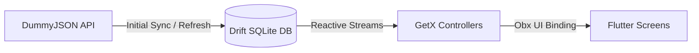

# Product Catalog (Offline-First)

A Flutter application built as a product catalog with an **offline-first** approach. Once data is synced from the API, the app runs entirely out of a local SQLite database powered by **Drift**, with **GetX** handling state management and **Google Sign-In** managing user authentication.

---

## What the App Does

- **Google Sign-In & Session Persistence:** Users log in using their Google account. User details are saved locally in SQLite, so returning users skip the login screen and head straight to the dashboard.
- **Initial Sync (Non-Dismissible):** On first login (or when manually refreshed), the app downloads categories and up to 200 products from DummyJSON with a live progress dialog. If the network drops, users can retry without losing already-saved categories.
- **Strictly Offline-First:** Screens never query the API directly. All screens listen to reactive Drift streams via GetX controllers. If you turn off Wi-Fi/mobile data, the whole app keeps working seamlessly.
- **Dashboard:** Displays user profile details, total categories and products synced, last sync timestamp, and quick actions (view categories, refresh catalog, log out).
- **Categories & Products:** 
  - Browse categories via a bottom sheet or a horizontal chip slider.
  - Search products in real time across title, brand, category, and description.
  - Sort products by price (low-high, high-low) or rating (high-low, low-high).
  - Pull-to-refresh to reload from the local database.
- **Product Details:** Image carousel with page indicator, pricing, discount badges, stock counts, rating, and description.
- **Favourites:** Add or remove items from the wishlist. Stored in SQLite and updated reactively across all screens.
- **Cart & Totals:** Add items, update quantities with `+`/`-` buttons (auto-removes at zero), and see live calculations for item count, subtotal, discount, and grand total.

---

## Architecture

The project follows a clean offline-first pattern where the database acts as the single source of truth for the UI:



```
API ──(Sync)──> Drift Database ──(watch() Streams)──> GetX Controller ──> UI (Obx)
```

No screen or controller talks to the network for daily browsing. Network calls happen solely inside sync routines, write straight to the database, and the UI reacts to table changes automatically.

---

## Tech Stack

- **Framework:** Flutter (Dart 3)
- **State Management:** GetX
- **Local Database:** Drift (SQLite) with DAOs and reactive queries (`watch()`)
- **Networking:** Dio (used only during initial data sync)
- **Authentication:** Google Sign-In & Firebase Core
- **Connectivity:** `internet_connection_checker_plus`

---

## Folder Structure

```text
lib/
├── core/
│   └── extensions/            # Helper extensions (safe parsing)
├── data/
│   ├── local/
│   │   ├── daos/              # DAOs for cart, categories, favourites, products, user
│   │   ├── database/          # Drift AppDatabase setup
│   │   └── tables/            # SQLite table definitions
│   ├── models/                # Data models and JSON deserializers
│   └── network/               # Dio API client and Google Auth service
├── presentation/
│   ├── controllers/           # GetX controllers (auth, cart, catalog, dashboard, sync)
│   ├── screens/
│   │   ├── auth/              # Login screen
│   │   ├── cart/              # Cart and checkout breakdown
│   │   ├── dashboard/         # User overview and metrics
│   │   ├── favourites/        # Saved items listing
│   │   ├── products/          # Category list, product cards, product details
│   │   └── splash/            # Animated splash with session check
│   └── widgets/               # Reusable dialogs (SyncProgressDialog)
└── main.dart                  # App entry point
```

---

## Getting Started

### 1. Prerequisites
- Flutter SDK (3.24+ recommended)
- Android Studio / VS Code
- A connected device or emulator

### 2. Install dependencies
```bash
flutter pub get
```

### 3. Generate Drift database files
If you modify tables or DAOs, run the build runner:
```bash
dart run build_runner build --delete-conflicting-outputs
```

### 4. Run the application
```bash
flutter run
```

---

## Build Commands

- **Android APK:**
  ```bash
  flutter build apk --release
  ```
